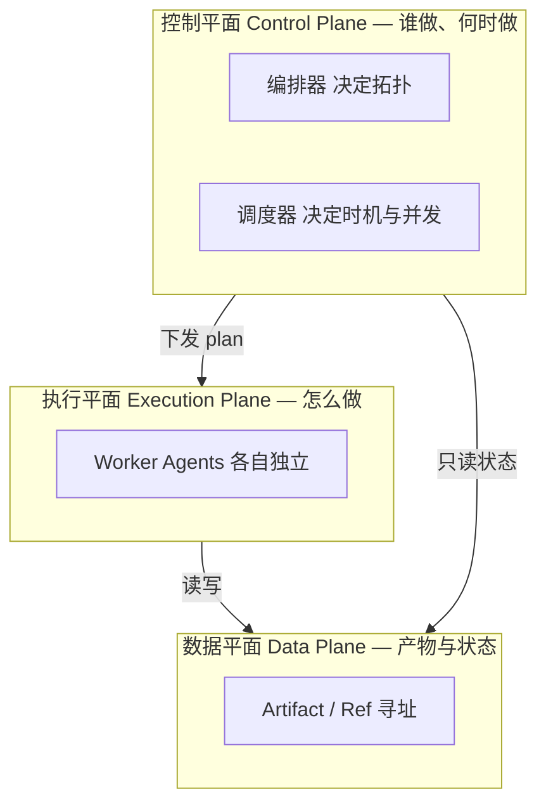
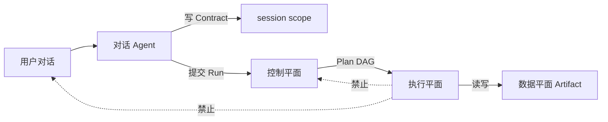
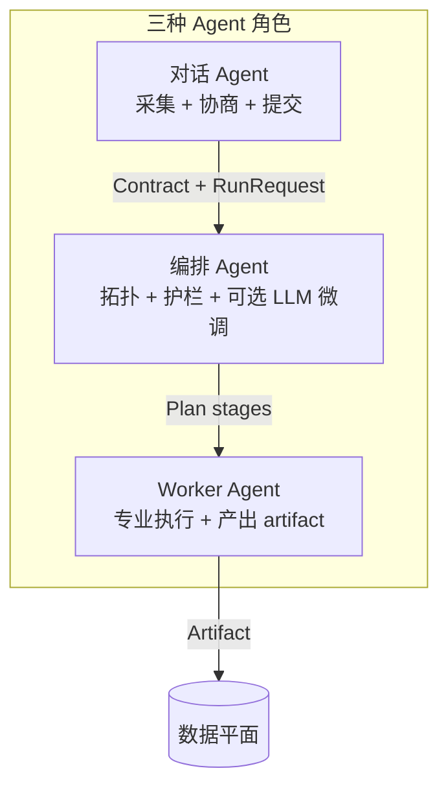
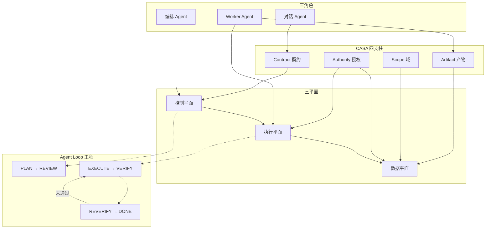

# 卡萨-CASA 多 Agent 协同架构方法论

> **一句话哲学**：让 LLM 做判断，让系统保证秩序。Agent 之间不传「对话」，只传「产物」；不靠「信任」，只靠「授权」。

> **来源**：多阶段分析/报告型多 Agent 系统的工程实践。
>
> **代码实现**：`casa/` Python 包 — 6 个子包、14 个可插拔 ABC、177+ 测试。
>
> **适用对象**：构建多阶段、多产物、强治理的分析/报告型多 Agent 系统的架构师与后端开发。

---

## 目录

1. [核心命名：CASA 是什么](#1-核心命名casa-是什么)
2. [心智模型：三平面分离](#2-心智模型三平面分离)
3. [CASA 四支柱](#3-casa-四支柱)
4. [Agent 角色三分法](#4-agent-角色三分法)
5. [编排方法论：编译优先，LLM 辅助](#5-编排方法论编译优先llm-辅助)
6. [执行方法论：Harness 与 Structured 双轨](#6-执行方法论harness-与-structured-双轨)
7. [扩展体系：14 个 ABC 可插拔架构](#7-扩展体系14-个-abc-可插拔架构)
8. [运行时代理工程：Agent Loop](#8-运行时代理工程agent-loop)
9. [多用户 × 多 Agent 关系设计](#9-多用户--多-agent-关系设计)
10. [反模式清单](#10-反模式清单)
11. [落地 Checklist](#11-落地-checklist)
12. [与业界框架对照](#12-与业界框架对照)
13. [方法论总图与摘要](#13-方法论总图与摘要)

---

## 1. 核心命名：CASA 是什么

**CASA** 由四根支柱的首字母组成：

| 字母    | 支柱                | 一句话                         |
| ----- | ----------------- | --------------------------- |
| **C** | **Contract（契约）**  | 跨层唯一语义源，结构化、可校验、不可被口头覆盖     |
| **A** | **Artifact（产物）**  | Agent 间唯一通信媒介，dataflow 而非传话 |
| **S** | **Scope（域）**      | 数据分层与统一 ref 寻址，承载隔离边界       |
| **A** | **Authority（授权）** | 能力安全，工具许可与数据许可正交取交集         |

多数失败的多 Agent 系统，错在让「对话上下文」既当数据又当控制流，让 LLM 既决策又执行。CASA 的核心是**把这些职责强制解耦**。

---

## 2. 心智模型：三平面分离

任何多 Agent 系统都应显式区分三个平面，绝不混用。



| 平面       | 职责                | 铁律              |
| -------- | ----------------- | --------------- |
| **控制平面** | 编排拓扑、调度时机、并发准入    | 只调度不分析，不碰业务数据内容 |
| **执行平面** | 单个 Agent 的具体分析/生成 | 只执行不编排，不决定上下游顺序 |
| **数据平面** | 产物存储、状态寻址、权限校验    | 只存取不决策，不承载控制逻辑  |

**关键推论**：对话历史属于「人机交互层」，不是 Agent 间通信层。Agent 之间只通过数据平面的 **Artifact + Ref** 协作。



---

## 3. CASA 四支柱

### 3.1 C — Contract（契约）：跨层唯一语义源

**定义**：一份结构化、可校验、不可被用户口头覆盖的「任务说明书」。例如 `AnalysisRequest`：`deliverable_type`、目标对象、`scope`、`preferences`。

**原则**：

1. **对话层只采集，不裁决**——对话 Agent 把自然语言收敛为 Contract，不自行改交付物硬规则。
2. **编排层只读 Contract，不读闲聊**——Plan Compiler 输入是 Contract + preset，而非整段聊天历史（LLM 编排只能是可选启用 / opt-in 微调）。
3. **执行层只消费 Contract 的物化副本**——Worker 读 `analysis_context` artifact，不直接解析用户原话。
4. **Contract 有版本与校验**——提交 Run 前必须 `validate()`；口头「跳过 QA」「只要好评」无效，除非已写入 Contract。

**可复用模式：Contract Gate**

```
用户输入 → 对话采集 → build Contract → validate → 持久化到 session
                                              ↓
                                    只有通过 Gate 才能 submit Run
```

**代码实现**：`ContractBuilder` 辅助逐字段采集，`ContractGate(min_contract_version=...)` 执行版本下限检查，`register_contract_migrator()` 支持 v1→v2 升级。

---

### 3.2 A — Artifact（产物）：Agent 间唯一通信媒介

**定义**：每个 Worker 有且仅有一个主 output，输入是若干上游 output 的只读引用。

**原则**：

1. **数据流（Dataflow），不是消息传递（Message-passing）**——不要 A 把一段话「发给」B；应是 A 写 `artifact_X`，B 读 `artifact_X`。
2. **一 Agent 一主产出（Single Writer）**——每个 artifact kind 理想情况只有一个 producer；多 producer 显式告警或禁止。
3. **产物必须结构化 + 可 schema 校验**——校验失败 = stage 失败，触发重试/降级，不把脏数据传给下游。
4. **产物是可跳过的幂等单元**——若 output artifact 已存在，stage 可 skip，这是并行安全与断点续跑的基础。
5. **编排依赖从 I/O 图推导，不手写**——`depends_on` 由 `input_artifacts` + producer 映射自动闭包，减少人工 DAG 错误。

**可复用模式：Artifact DAG**

```
[raw_data]
    ↓
[intel_A] [intel_B]      ← 并行 wave
    ↓
[processed_corpus]
    ↓
[analytics]
    ↓
[perspective_*] × N      ← 并行 wave
    ↓
[report_ch_*] × M        ← 并行 wave（依赖各异）
    ↓
[assembled_output]
    ↓
[qa_report]
```

**代码实现**：`ArtifactDAG.from_declarations()` 从 I/O 声明自动推导 + DFS 三色环检测 + `partition_waves()` 波次划分。`ArtifactStore` 统一读写门面（支持 Local / S3 / MinIO 三个后端）。`ArtifactLifecycleManager` 按 ephemeral/session/job/permanent 四级保留策略自动清理。

---

### 3.3 S — Scope（域）：数据分层与寻址

**定义**：所有数据通过统一 `ref_id` 寻址，并按 scope 划分隔离边界。

| Scope        | 语义      | 隔离键                  | 典型用途              |
| ------------ | ------- | -------------------- | ----------------- |
| **global**   | 平台共享只读  | 无                    | 知识库、Agent 模板、工具定义 |
| **user**     | 用户私有    | `user_id`            | 个人知识库             |
| **session**  | 会话上下文   | `session_id`         | intake、brief      |
| **job/task** | 一次运行的产出 | `job_id` + `plan_id` | 中间/最终 artifact    |

**ref_id 命名示例**：

```
global:knowledge:{path}
user:{uid}:kb:{doc_id}
session:{sid}:doc:brief
session:{sid}:intake:{field}
job:{jobId}:artifact:{kind}
```

**原则**：

1. **禁止裸 key**——不允许 `read("theme_analytics")`，必须是 `job:{jid}:artifact:theme_analytics`。
2. **读写都带归属校验**——`job_id` / `session_id` / `user_id` 必须在运行时上下文中匹配，不能仅靠「知道 ID」。
3. **session 与 job 分离**——session 存「意图与对话状态」，job 存「一次执行的产物」；同一会话可多次 run、多个 plan。
4. **global 只读**——平台配置与知识库对所有用户可见但不可被 Worker 写入。

**可复用模式：Ref Catalog**——每个会话/run 应能列出「当前可见 ref 列表」（数据目录 / data-catalog），供 Agent 发现数据，而非硬编码路径。

**代码实现**：`RefID` 不可变类型（`__slots__`），工厂方法保证命名一致 + Unicode 易混淆冒号检测。`DataStore` 统一读写门面，五层范围路由 + 归属校验。`RefCatalog.build()` 动态构建可见数据列表，含 KB 驱动的知识库条目自动注入。

---

### 3.4 A — Authority（授权）：能力安全，双许可正交

**定义**：Agent 能做什么，由两套独立许可的**交集**决定。

| 许可类型     | 控制什么                            | 类比         |
| -------- | ------------------------------- | ---------- |
| **工具许可** | 能否调用某 tool                      | API 端点权限   |
| **数据许可** | 能否读写某 artifact kind / ref scope | 行级/对象级 ACL |

**原则**：

1. **有工具权 ≠ 有数据权**——拥有 `read_artifact` 工具，仍只能读 `input_artifacts` 白名单内的 kind。
2. **有数据权 ≠ 有工具权**——structured Agent 通过编排注入读数据，不必授工具；harness Agent 需显式授工具。
3. **写权限单一**——每个 Agent 只有一个 `output_artifact` 写键；改 output 须 clone 新 Agent，防历史 run 血缘断裂。
4. **surface 隔离**——对话工具与 Worker 工具分 surface，防误授。
5. **授权变更下次 run 生效**——热更新许可/定义，使缓存失效；正在跑的 run 不受影响。

**可复用模式：Capability Matrix**——设计新 Agent 时填一张表：

| Agent              | 工具许可                                                                    | 数据读                                  | 数据写                 | surface  |
| ------------------ | ----------------------------------------------------------------------- | ------------------------------------ | ------------------- | -------- |
| dialogue_intake    | 对话工具集                                                                   | session/user/global                  | session             | dialogue |
| perspective_analyst | read_artifact, read_corpus, search_knowledge, submit_structured_output | feature_analytics, source_corpus, ... | perspective_output_* | harness  |
| report_writer       | 无（structured）                                                           | feature_analytics, perspective_output_* | report_chapter       | —        |

**代码实现**：`CapabilityRow` 22 个字段（身份 / 许可 / 模型 / 评估者 / 沙箱 / 调度）的标准模板。`AuthorityResolver` 合并代码默认（Code Default）与数据库覆盖（DB Override）（`check_access(tool_id, artifact_read, artifact_write, kb_id)` 四维正交校验）。`PgGrantStore` 提供 PG 生产级许可持久化参考实现。

---

## 4. Agent 角色三分法

不要把所有 LLM 调用都叫「Agent」。至少分三种角色，职责不可混。



| 角色               | 输入                          | 输出                               | 禁止              |
| ---------------- | --------------------------- | -------------------------------- | --------------- |
| **对话 Agent**     | 用户自然语言                      | 更新的 intake / brief、RunRequest    | 亲自做分析、改交付物硬规则   |
| **编排 Agent**     | Contract + preset + catalog | stage DAG（depends_on、input_refs） | 预写分析结论、编造 KPI   |
| **Worker Agent** | 上游 artifact + Contract 物化   | 一个结构化 output artifact            | 决定上下游顺序、调用未授权工具 |

**扩展角色**（可选）：
- **Assembler**：多 artifact 合并为终态。
- **Evaluator**：独立评估 Agent（`is_evaluator=True`），与执行 Agent 分离——来自 Anthropic「构建者与评判者必须分离」（builder and judge must be separate）原则。
- **Synthesizer**：多视角压缩为洞察 bundle。

---

## 5. 编排方法论：编译优先，LLM 辅助

### 5.1 三层编排生命周期

```
编译时 Compile   →  运行时 Normalize  →  执行时 Execute
(preset + IO图)      (护栏 + 裁剪)        (DAG 波次并行)
```

| 阶段            | 输入                                      | 输出                                 | 谁做            |
| ------------- | --------------------------------------- | ---------------------------------- | ------------- |
| **编译（Compile）**   | preset.selected_agents + Contract.scope | stage 列表 + 闭包 + terminal_artifacts | Plan Compiler |
| **规范化（Normalize）** | 原始 plan + deliverable 规则                | 合法 plan（补 core、剔禁用、加 qa）           | PlanNormalizer |
| **执行（Execute）**   | plan + AgentContext                     | 逐波次执行 + 写 artifact             | PlanExecutor |

### 5.2 核心规则

1. **确定性编译是主路径**——LLM 编排是可选启用（opt-in），且结果必须过 normalize 兜底。
2. **依赖闭包自动推导**——从 artifact producer 图推导 `depends_on`，下游模块依赖上游 slice 时必须等对应 stage。
3. **交付物类型决定拓扑裁剪**——不同交付物是不同 UsagePolicy，不是同一 DAG 的简单开关。
4. **并行保守**——只有 `depends_on` 全满足的 stage 才能进同一 wave。

### 5.3 意图驱动的动态编排

**代码实现**：`IntentRouter`（`casa/intent.py`）支持自然语言 → Agent 集合的自动选择。输入 Agent 能力目录（ID + 描述 + 标签），输出 `IntentResult(agent_ids, policy)`。结合 `Orchestrator.run_from_intent()` 实现一条龙体验：

```
用户自然语言 → IntentRouter → CompileRequest → PlanCompiler → PlanExecutor → CompileResult
```

LLM 返回的 agent_id 经过 catalog 白名单校验（防幻觉），Normalizer 始终兜底（补 core pipeline、剔禁用 agent）。

### 5.4 四层流水线模板（领域可替换）

```
Layer 1 采集/摄入    → 并行拉取多源 raw data
Layer 2 处理/特征    → 串行清洗、结构化
Layer 3 分析/视角    → 并行多视角深度解读
Layer 4 交付/组装    → 并行生成模块 → 串行组装 → 串行 QA
```

换领域只需替换 Agent 池，骨架不变。

---

## 6. 执行方法论：Harness 与 Structured 双轨

### 6.1 执行画像（Profile）选型

| Profile（执行画像）            | 何时用                 | 优点                    | 缺点       |
| ------------------ | ------------------- | --------------------- | -------- |
| **deterministic（确定性）**  | 纯代码/API 采集          | 零幻觉、可测                | 非 LLM    |
| **structured（结构化）**     | 输入可全量注入、输出固定 schema | 简单、便宜、稳定              | 上下文受限    |
| **harness（工具循环）**        | 需按需读数据、搜知识、多步推理     | 灵活、可探索                | 贵、慢、需双许可 |
| **report_chapter（报告章节）** | 报告章节生成              | 与 structured 类似，带章节包装 | 领域专用     |

**决策树**：

```
能否在单次 prompt 内注入全部输入？
  ├─ 是 → structured / report_chapter
  └─ 否 → harness（授工具 + 限 max_iterations）
         └─ 失败时？→ native_fallback 降级 structured（可选）
```

### 6.2 Harness 配置分离

- **harness_config**：`max_iterations`、`task_template`、`native_fallback`（运行时参数）。
- **工具许可表**：工具白名单（授权）。
- **input_artifacts**：数据读白名单（授权）。

三者独立配置，不要写进 prompt「你可以用这些工具」来代替正式 grants。

### 6.3 Stage 容错链（可复用模板）

```
简单重试 ×2 → 新 LLM 会话重试 ×1 → 编排器补救 stage → 失败上报
```

补救由编排 Agent 决定 mitigation stage，不是 Worker 自行决定跳过。

**代码实现（`casa/recovery.py`）**：`RecoveryChain` 支持四种可组合策略——`SimpleRetryStrategy`、`ExponentialBackoffStrategy`、`FreshSessionStrategy`、`SkipStrategy`。领域项目可实现自定义策略替换。

### 6.4 多模型路由

`CapabilityRow.model_preference` 声明每个 Agent 的模型偏好。`LLMProviderConfig` + `llm_providers` 字典支持多组 API 凭据（analyst 用 Anthropic、fetcher 用 OpenAI 等）。`StageRunner._execute()` 自动根据 `model_preference` 解析对应凭据并注入 `context["llm_config"]`。

### 6.5 独立评估者（Evaluator）

`CapabilityRow.is_evaluator=True` 将 Agent 标记为独立评估者。`PlanCompiler` 自动在每个 producer stage 后注入 `EvalStage`——评估者与执行者分离，遵循 Anthropic「构建者与评判者必须分离」原则。

---

## 7. 扩展体系：14 个 ABC 可插拔架构

方法论描述的是设计范式，`casa/` 代码库将其实现为 14 个 ABC（抽象基类）加 3 个生产参考实现的可插拔架构。所有 ABC 遵循统一的「ABC 定义 + InMemory 参考实现 + 全局单例 + reset 函数」模式。

| ABC | 现实 | 生产后端 |
|------|------|---------|
| `ArtifactBackend` | `LocalArtifactBackend` | `S3ArtifactBackend`（参考实现） |
| `SchedulerBackend` | `InMemorySchedulerBackend` | `RedisSchedulerBackend`（Lua）、`PgSchedulerBackend`（行级锁） |
| `GrantStore` | `InMemoryGrantStore` | `PgGrantStore`（参考实现） |
| `KnowledgeBase` | `InMemoryKnowledgeBase`（含 `embed_fn` 向量搜索） | pgvector（需领域实现） |
| `EventBus` | `InProcessEventBus`（fnmatch 模式匹配 + trace） | Redis/Kafka（需领域实现） |
| `AgentExecutor` | `SimpleAgentExecutor` / `MockAgentExecutor` / `SandboxedAgentExecutor` | 领域项目实现 |
| `AgentMemory` | `InMemoryAgentMemory` | PG/Redis（需领域实现） |
| `MetricsSink` | `InMemoryMetricsSink` | Prometheus |
| `AuditSink` | `NullAuditSink` / `InMemoryAuditSink` | PG/ES |
| `RecoveryStrategy` | `SimpleRetry`、`ExponentialBackoff`、`FreshSession`、`Skip` | 领域项目实现 |
| `DeliverableRenderer` | `DefaultJsonRenderer` | HTML/PDF |
| `PipelineHook` | `HookRegistry`（10 生命周期） | 领域项目实现 |
| `TenantManager` | `InMemoryTenantManager`（含多维度配额 + token 追踪） | PG/Redis |
| `SchemaRegistry` | `InMemorySchemaRegistry` | PG |
| `ArtifactCacheBackend` | `LocalArtifactCache` | Redis |

**生产后端的 ABC 契约**：
- `SchedulerBackend.atomic_accept_run()`：slot + save + heartbeat 三步原子化（生产级需覆写）
- `ArtifactBackend`：write/read/list_keys/exists/delete + write_deliverable_file/read_deliverable_file
- `GrantStore`：load_tool_grants / load_data_grants

---

## 8. 运行时代理工程：Agent Loop

基于 Anthropic Loop Engineering 双层验证架构（Inner/Outer Loop），`casa/loop.py` 实现了完整的循环状态机：

```
                    ┌──────────────────────────────────┐
                    │                                   │
    PLAN ──→ REVIEW ──→ EXECUTE ──→ VERIFY ──→ REVERIFY ──→ DONE
      ↑                                    │            │
      │        发现问题                     │  通过      │ 有问题
      └────────────────────────────────────┘            │
                                                       │
                                              ┌────────┘
                                              │
                                          ITERATE
                                     (注入问题到下次 PLAN)
```

**核心保证**：

| 模式 | CASA 实现 |
|------|---------|
| 内层循环 Inner Loop（概率性自检） | Agent 自己的 `quality_score` + 自评 |
| 外层循环 Outer Loop（确定性验证） | `EvalStage` 独立评估者 + `QualityGate` 声明式质量门 |
| 「完成」必须机器可检查 | `require_double_pass` + verifier 两次返回空 |
| 构建者 ≠ 评判者（Builder ≠ Judge） | `is_evaluator=True` → 自动分离 |
| 定义所有出口 | `max_iterations` + `loop_timeout` + `InterruptController.abort()` |
| 上下文是有限资源 | `_trim_context()` 预算监控 + 自动截断 |

**代码入口**：

```python
from casa.loop import AgentLoop

loop = AgentLoop(
    orch,
    verifier=AgentLoop._default_verifier,
    max_iterations=5,
    require_double_pass=True,
)
result = await loop.run("做一份竞品分析报告", router=router)
# 循环直到连续两次验证通过，或达到 max_iterations
```

**运行时控制**：`InterruptController` 支持暂停/恢复/优雅终止/立即终止。在 loop 的每个迭代开始时检测——用户可随时中断 loop 而不丢失已完成轮次的 artifact。

---

## 9. 多用户 × 多 Agent 关系设计

### 9.1 实体关系心智图

```
User ──1:N── Session ──1:1── Job ──1:N── Plan ──1:N── Stage ──N:1── Agent
  │              │                    │
  └─1:N─ UserKB                 └─N:M─ Artifact (经 job/plan 隔离)

Platform (global) ─N:M─ AgentDefinition ─N:M─ Tool (via grants)
                  ─N:M─ Preset ─N:M─ Agent (via selected_agent_ids)
                  ─1:N─ ArtifactDictionary
```

### 9.2 五条关系设计原则

1. **平台配置全局共享，运行时数据按用户/任务隔离**——Agent 定义、工具、preset 全平台一份；artifact、session 按 user/job 隔离。
2. **多对多优先 JSONB 边表 + 应用层校验**——灵活优先于 FK；用启动期/CI 不变量测试补完整性。
3. **有效规格（Effective Spec）：代码默认 + DB 覆盖**——原生 Agent 有代码默认值，DB 可覆盖 I/O 而不改代码。
4. **单 Writer 血缘**——artifact kind → 唯一 producer，consumer 通过 IO 图声明依赖。
5. **Run 是调度的原子单位**——会话可多次 Run；每次 Run 占并发槽、有意图（intent）、支持幂等键（idempotency_key）。

### 9.3 并发模型

- **会话级槽位**：限制单用户同时跑几个重任务（非全局 LLM QPS）。
- **Plan 内波次并行**：同一 wave 内多 stage 并发执行。
- **自适应并发**：`_adaptive_max_parallel()` 基于历史时间方差动态放宽（仅放宽，不缩小）。
- **Worker 无共享 LLM 上下文**：并行安全来自 artifact 隔离。

> ⚠️ **分布式提醒**：若多副本部署，调度槽位/队列/幂等状态必须外置（Redis Lua 原子操作或 PG 行级锁），不能放进程内内存。`RedisSchedulerBackend` 和 `PgSchedulerBackend` 均已提供参考实现，开箱即用。

### 9.4 多租户支持

- `tenant_id` 透明注入：Contract → RunRecord → ArtifactStore → DataStore → Orchestrator
- `InMemoryTenantManager`：租户 CRUD + 多维度配额（`max_parallel`、`daily_tokens`、`daily_cost_cents`、`daily_runs`）
- `Scheduler.submit()` 在 slot 分配前检查所有配额维度

---

## 10. 反模式清单

| 反模式                    | 为什么错                | CASA 正解              |
| ---------------------- | ------------------- | -------------------- |
| Agent 链式传话             | 上下文膨胀、不可并行、难调试      | Artifact 数据流（dataflow）    |
| 编排器亲自分析                | 角色混乱、幻觉进 plan       | 编排只输出拓扑 JSON         |
| 用户口头改交付物               | 注入攻击、规则被绕过          | Contract Gate + 硬规则  |
| 工具列表写进 prompt          | 授权不可治理              | 正式 grants 表          |
| 裸 artifact key         | 无隔离、无归属             | ref_id 多 scope       |
| 多 Agent 共享 LLM session | 竞态、不可恢复             | 每 stage 独立 context   |
| 全靠 LLM 决定 DAG          | 不稳定、缺 core pipeline | 编译优先 + normalize     |
| 调度状态放进程内存              | 多副本失效               | Redis/PG 外置状态        |
| 删 Agent 不级联词典          | 悬空引用                | decommission + 不变量测试 |
| 对话历史当 Worker 输入        | 噪声大、难复现             | analysis_context 物化  |
| Agent 自评自己的产出           | 结构性盲区——无法发现自身模式错误  | 独立 EvalStage + QualityGate |
| 单次验证即结束               | 随机性导致偶发通过           | 双次验证（Double-pass）：连续两次验证通过 |

---

## 11. 落地 Checklist

### Phase 0 — 领域建模

- [ ] 列出终态交付物类型
- [ ] 画出四层流水线草图（采集→处理→分析→交付）
- [ ] 定义 artifact 词典（kind、schema、producer）

### Phase 1 — 数据平面

- [ ] 设计 ref_id 规范（至少 job + session + user + global）
- [ ] 实现 DataStore facade（resolve_read/write + 归属校验）
- [ ] 选定 artifact 存储与 `job/plan` 目录结构

### Phase 2 — 契约与对话层

- [ ] 定义 Contract schema
- [ ] 对话 Agent 只做 intake + validate + submit Run
- [ ] Contract 持久化到 session，提交前校验

### Phase 3 — 编排层

- [ ] preset + selected_agents + auto_closure
- [ ] Plan Compiler 从 IO 图推导 depends_on
- [ ] normalize 护栏（core pipeline、交付物硬规则）
- [ ] LLM 编排设为可选启用（opt-in）

### Phase 4 — 执行层

- [ ] Agent 注册表 + execution_profile 分型
- [ ] plan_executor 波次并行 + skip-if-exists
- [ ] stage 容错链（重试 → 新会话 → replan）
- [ ] Harness：双许可 + tool loop + terminal tool
- [ ] 独立评估者（is_evaluator=True）

### Phase 5 — 治理与多用户

- [ ] 双许可矩阵（每 Agent 填 capability table）
- [ ] session 归属 user_id，API 强制校验
- [ ] 调度状态外置（若多副本）
- [ ] 连接池 + 缓存失效策略
- [ ] 进度通道（WebSocket/Redis）+ 可观测（usage events）

### Phase 6 — 平台化

- [ ] Agent CRUD + clone + provisioner
- [ ] 工具库 + grants 管理 UI
- [ ] preset 试编译 + IO 图预览
- [ ] 不变量测试（引用完整性、grant 校验、compiler 闭包）
- [ ] Agent Loop + 质量门 + 双次验证

---

## 12. 与业界框架对照

| 能力        | CASA（本方法论）            | LangGraph       | CrewAI          | Temporal      |
| --------- | --------------------- | --------------- | --------------- | ------------- |
| Agent 间通信 | Artifact 数据流（dataflow） | State / Message | 任务委托（Task delegation） | Activity I/O  |
| 编排        | 编译优先 DAG              | Graph edges     | Role hierarchy  | Workflow code |
| 权限        | 双许可 capability        | 无内置             | 无内置             | 无内置           |
| 独立评估     | EvalStage + QualityGate | 无内置             | 无内置             | 无内置           |
| Loop 工程   | 双次验证（Double-pass）七阶段循环     | —               | —               | —             |
| 持久化执行     | artifact + 幂等 resume   | Checkpoint      | 弱               | 强             |
| 多租户       | ref scope + user_id   | 需自建             | 需自建             | 需自建           |
| 多模型路由     | CapabilityRow + Provider | 需自建             | 需自建             | 需自建           |
| 适合场景      | 长链路分析/报告          | 灵活 Agent 图      | 快速原型            | 企业级持久执行（durable）   |

**结论**：CASA 更适合「多阶段、多产物、强治理的分析/报告流水线」。若需要通用 Agent 图探索，可借鉴 LangGraph 的状态图；若需要金融级持久执行，编排层可换 Temporal，但 **Artifact + 双许可 + Contract** 仍可保留。

---

## 13. 方法论总图与摘要



> **摘要**：用 Contract 统一意图，用 Artifact 隔离协作，用 Scope 划分数据边界，用 Authority 约束能力；控制平面编排拓扑，执行平面独立产出（含独立评估者），数据平面承载一切状态。Agent Loop 确保 Plan→Execute→Verify→Reverify 循环直到连续两次验证通过。**LLM 负责判断，系统负责秩序。**
